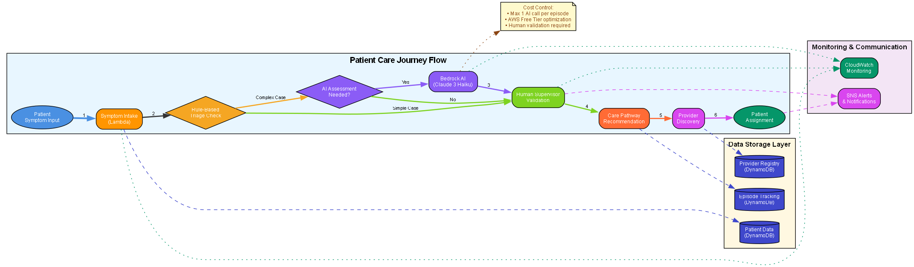
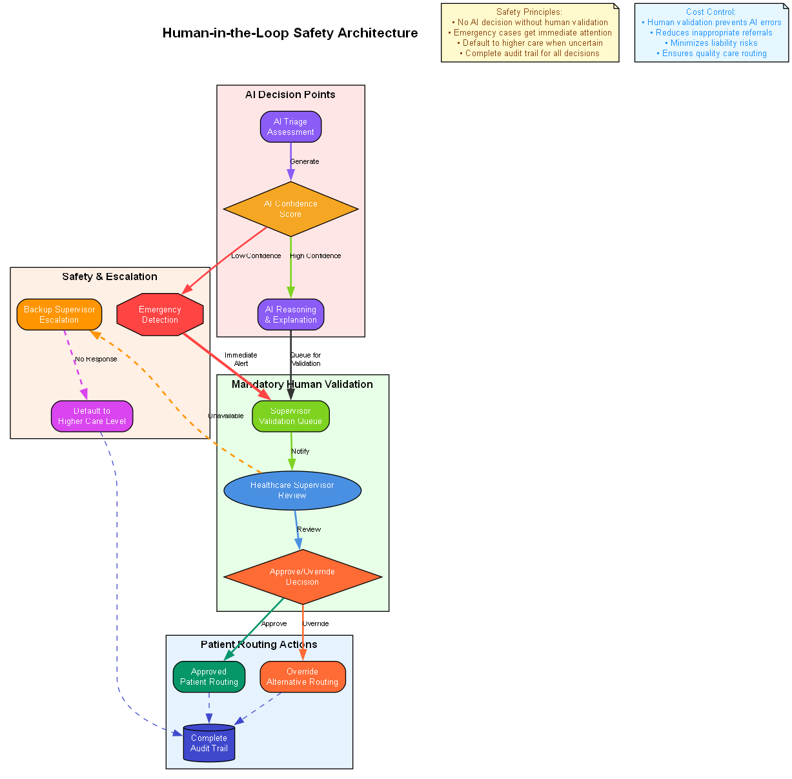

# Design Document: AI-Enabled Decentralized Care Orchestration System

## Overview

The AI-enabled decentralized care orchestration system is a serverless, event-driven architecture built on AWS that intelligently routes patients to appropriate care levels while maintaining strict human oversight. The system uses a combination of rule-based triage and selective AI assistance to assess symptoms, recommend care pathways, and coordinate patient flow across India's healthcare network.

The architecture prioritizes cost efficiency, scalability, and responsible AI practices by limiting AI inference to one call per care episode and requiring human validation for all critical decisions. The system is designed to work effectively in India's diverse connectivity and resource environments.

## Architecture

### High-Level Architecture


The system follows a serverless microservices architecture with the following key components:

**Architecture Overview**: The diagram above shows the complete AWS serverless architecture with official service colors and icons. Key components include:

- **User Interfaces**: Patient Portal (PWA), Healthcare Supervisor Dashboard, System Administrator Console
- **API Layer**: Amazon API Gateway with Cognito authentication
- **Compute Layer**: 7 AWS Lambda microservices for different functions
- **Data Layer**: Amazon DynamoDB for patient and provider data
- **AI Layer**: Amazon Bedrock (Claude 3 Haiku) with strict usage limits
- **Communication**: Amazon SNS for notifications and alerts
- **Monitoring**: Amazon CloudWatch for comprehensive system monitoring

### Component Interaction Flow



1. **Patient Intake**: Patient submits symptoms through Patient Portal
2. **Initial Triage**: Rule-based assessment determines if AI assistance is needed
3. **AI Assessment** (if needed): Single Bedrock call for complex cases
4. **Human Validation**: Healthcare supervisor validates all AI recommendations
5. **Care Routing**: System routes patient to appropriate provider
6. **Episode Tracking**: All interactions logged for continuity
7. **Escalation**: Automated referral workflows when care level changes needed

## Components and Interfaces

### 1. Patient Portal (Frontend)

**Purpose**: Web and mobile interface for patient symptom intake and care tracking

**Key Features**:
- Progressive Web App (PWA) for offline capability
- Multilingual support (Hindi, English, extensible)
- Low-bandwidth optimized design
- Voice input integration (optional)

**Interfaces**:
- REST API calls to API Gateway
- Real-time updates via WebSocket (for care status)
- Integration with Amazon Cognito for authentication

### 2. Symptom Intake Service (Lambda)

**Purpose**: Captures, validates, and structures patient symptom data

**Key Functions**:
- Input validation and sanitization
- Structured symptom data extraction
- Integration with Amazon Transcribe for voice input
- Initial data quality checks

**Interfaces**:
- Input: Patient Portal HTTP requests
- Output: Structured symptom data to DynamoDB
- Triggers: Triage Engine Lambda function

### 3. Triage Engine (Lambda)

**Purpose**: Assesses symptom urgency using rules and selective AI assistance

**Key Functions**:
- Rule-based urgency classification
- Decision logic for AI assistance necessity
- Amazon Bedrock integration (limited to one call per episode)
- Urgency scoring and care pathway recommendation

**Interfaces**:
- Input: Structured symptom data from DynamoDB
- Output: Triage assessment and care recommendations
- External: Amazon Bedrock API (conditional)
- Triggers: Human Validation Service

### 4. Human Validation Service (Lambda)



**Purpose**: Manages healthcare supervisor review and approval workflow

**Key Functions**:
- Validation queue management
- Supervisor notification and dashboard updates
- Override and approval tracking
- Escalation for unavailable supervisors

**Interfaces**:
- Input: Triage recommendations requiring validation
- Output: Validated care decisions
- Notifications: SNS for supervisor alerts
- Triggers: Care Coordinator Service

### 5. Provider Discovery Service (Lambda)

**Purpose**: Identifies and ranks appropriate healthcare providers

**Key Functions**:
- Provider filtering by specialty and location
- Availability checking and capacity management
- Distance calculation and ranking
- Cost and insurance compatibility assessment

**Interfaces**:
- Input: Care requirements and patient location
- Output: Ranked list of suitable providers
- Data: Provider Network database in DynamoDB

### 6. Care Coordinator Service (Lambda)

**Purpose**: Orchestrates patient routing and care pathway execution

**Key Functions**:
- Care pathway execution
- Provider assignment and notification
- Patient communication and guidance
- Care episode state management

**Interfaces**:
- Input: Validated care decisions and provider selections
- Output: Patient routing instructions and provider notifications
- Integration: SNS for notifications, DynamoDB for state tracking

### 7. Referral Manager (Lambda)

**Purpose**: Handles escalation and referral workflows between care levels

**Key Functions**:
- Referral request processing
- Higher-level provider identification
- Patient context transfer
- Referral tracking and follow-up

**Interfaces**:
- Input: Referral requests from providers
- Output: Completed referrals with context transfer
- Integration: Provider Discovery Service, Episode Tracker

### 8. Episode Tracker (Lambda)

**Purpose**: Maintains comprehensive care episode history and continuity

**Key Functions**:
- Episode lifecycle management
- Interaction logging and audit trails
- Care continuity data aggregation
- Outcome tracking and analytics

**Interfaces**:
- Input: All care interactions and decisions
- Output: Episode summaries and continuity reports
- Storage: DynamoDB with time-series optimization

## Data Models

### Patient Record
```json
{
  "patientId": "string (UUID)",
  "demographics": {
    "age": "number",
    "gender": "string",
    "location": {
      "state": "string",
      "district": "string",
      "pincode": "string",
      "coordinates": {"lat": "number", "lng": "number"}
    },
    "preferredLanguage": "string",
    "insuranceInfo": {
      "provider": "string",
      "policyNumber": "string",
      "coverage": "object"
    }
  },
  "medicalHistory": {
    "conditions": ["string"],
    "medications": ["string"],
    "allergies": ["string"],
    "lastVisit": "timestamp"
  },
  "preferences": {
    "providerGender": "string",
    "maxTravelDistance": "number",
    "costSensitivity": "string"
  },
  "createdAt": "timestamp",
  "updatedAt": "timestamp"
}
```

### Care Episode
```json
{
  "episodeId": "string (UUID)",
  "patientId": "string (UUID)",
  "status": "string (active|completed|escalated)",
  "symptoms": {
    "primaryComplaint": "string",
    "duration": "string",
    "severity": "number (1-10)",
    "associatedSymptoms": ["string"],
    "inputMethod": "string (text|voice)"
  },
  "triage": {
    "urgencyLevel": "string (emergency|urgent|routine|self-care)",
    "ruleBasedScore": "number",
    "aiAssessment": {
      "used": "boolean",
      "confidence": "number",
      "reasoning": "string"
    },
    "humanValidation": {
      "supervisorId": "string",
      "approved": "boolean",
      "overrideReason": "string",
      "timestamp": "timestamp"
    }
  },
  "carePathway": {
    "recommendedLevel": "string",
    "assignedProvider": "string",
    "alternativeProviders": ["string"],
    "estimatedCost": "number",
    "expectedDuration": "string"
  },
  "interactions": [{
    "timestamp": "timestamp",
    "type": "string",
    "actor": "string",
    "details": "object"
  }],
  "outcome": {
    "resolution": "string",
    "followUpRequired": "boolean",
    "patientSatisfaction": "number",
    "costActual": "number"
  },
  "createdAt": "timestamp",
  "updatedAt": "timestamp"
}
```

### Provider Record
```json
{
  "providerId": "string (UUID)",
  "type": "string (hospital|clinic|specialist|pharmacy)",
  "name": "string",
  "location": {
    "address": "string",
    "state": "string",
    "district": "string",
    "pincode": "string",
    "coordinates": {"lat": "number", "lng": "number"}
  },
  "capabilities": {
    "specialties": ["string"],
    "services": ["string"],
    "equipment": ["string"],
    "languages": ["string"]
  },
  "capacity": {
    "totalBeds": "number",
    "availableBeds": "number",
    "dailyPatientCapacity": "number",
    "currentLoad": "number"
  },
  "qualityMetrics": {
    "rating": "number (1-5)",
    "patientReviews": "number",
    "successRate": "number",
    "averageWaitTime": "number"
  },
  "costStructure": {
    "consultationFee": "number",
    "insuranceAccepted": ["string"],
    "paymentMethods": ["string"]
  },
  "availability": {
    "hours": "object",
    "emergencyAvailable": "boolean",
    "lastUpdated": "timestamp"
  },
  "credentials": {
    "licenses": ["string"],
    "certifications": ["string"],
    "verified": "boolean"
  },
  "createdAt": "timestamp",
  "updatedAt": "timestamp"
}
```

### Referral Record
```json
{
  "referralId": "string (UUID)",
  "episodeId": "string (UUID)",
  "fromProvider": "string (UUID)",
  "toProvider": "string (UUID)",
  "urgency": "string (emergency|urgent|routine)",
  "reason": "string",
  "patientContext": {
    "symptoms": "object",
    "assessments": "object",
    "treatments": "object",
    "notes": "string"
  },
  "status": "string (pending|accepted|completed|rejected)",
  "timeline": {
    "requestedAt": "timestamp",
    "acceptedAt": "timestamp",
    "completedAt": "timestamp"
  },
  "outcome": {
    "diagnosis": "string",
    "treatment": "string",
    "followUp": "string"
  }
}
```

Now I need to use the prework tool to analyze the acceptance criteria before writing the Correctness Properties section:

<function_calls>
<invoke name="prework">
<parameter name="featureName">decentralized-healthcare-orchestration

## Correctness Properties

*A property is a characteristic or behavior that should hold true across all valid executions of a system—essentially, a formal statement about what the system should do. Properties serve as the bridge between human-readable specifications and machine-verifiable correctness guarantees.*

After analyzing the acceptance criteria, I've identified the following properties that eliminate redundancy while ensuring comprehensive coverage:

### Property 1: Symptom Data Capture and Validation
*For any* patient symptom input (text or voice), the Care_Orchestrator should successfully capture, validate, and store the data with appropriate prompting for missing essential information.
**Validates: Requirements 1.2, 1.4, 1.5**

### Property 2: Triage Assessment Completeness
*For any* symptom data received, the Triage_Engine should produce a complete assessment categorized as emergency, urgent, routine, or self-care using rules-first approach.
**Validates: Requirements 2.1, 2.3**

### Property 3: AI Usage Constraint
*For any* Care_Episode, the system should make at most one LLM call, and only when clinical rules are insufficient for assessment.
**Validates: Requirements 2.2, 2.5**

### Property 4: Human Validation Requirement
*For any* AI-generated assessment, the Care_Orchestrator should require and wait for Human_Supervisor validation before proceeding with patient routing.
**Validates: Requirements 2.4, 7.1, 7.4**

### Property 5: Emergency Response Protocol
*For any* emergency situation detected, the system should immediately alert Human_Supervisor and provide hospital routing with complete contact details.
**Validates: Requirements 3.2, 7.2**

### Property 6: Care Pathway Generation
*For any* validated urgency assessment, the Care_Orchestrator should generate appropriate care pathway recommendations with provider options and guidance.
**Validates: Requirements 3.1, 3.3, 3.4, 3.5**

### Property 7: Provider Data Integrity
*For any* provider in the network, the system should maintain complete information including specialties, location, capacity, availability, credentials, and quality ratings.
**Validates: Requirements 4.1, 4.5**

### Property 8: Provider Search and Ranking
*For any* provider search request, the system should filter by relevant criteria and rank results by distance, availability, and patient preferences.
**Validates: Requirements 4.2, 4.4**

### Property 9: Real-time Capacity Management
*For any* provider capacity change, the system should update availability status immediately and reflect changes in search results.
**Validates: Requirements 4.3**

### Property 10: Referral Workflow Completeness
*For any* referral request, the system should identify appropriate higher-level providers, transfer complete patient context, and update episode records.
**Validates: Requirements 5.1, 5.2, 5.3, 5.5**

### Property 11: Urgent Notification Protocol
*For any* urgent escalation, the system should notify receiving providers immediately via SNS and ensure rapid response capability.
**Validates: Requirements 5.4**

### Property 12: Episode Lifecycle Management
*For any* Care_Episode, the system should create unique identifiers, record all interactions, enable history retrieval, and store final outcomes.
**Validates: Requirements 6.1, 6.2, 6.3, 6.5**

### Property 13: Care Continuity Preservation
*For any* care transition between providers, the system should ensure complete information transfer without data loss.
**Validates: Requirements 6.4**

### Property 14: Human Override Authority
*For any* disagreement between Human_Supervisor and AI assessment, the system should use human judgment as the final decision.
**Validates: Requirements 7.3**

### Property 15: Supervisor Availability Handling
*For any* situation where Human_Supervisor is unavailable, the system should escalate to backup supervisors or default to higher care level.
**Validates: Requirements 7.5**

### Property 16: Low-Bandwidth Optimization
*For any* poor network connectivity scenario, the Patient_Portal should function with minimal data usage and offline capability.
**Validates: Requirements 8.2**

### Property 17: Cost-Conscious Routing
*For any* cost-sensitive patient, the system should prioritize affordable care options in recommendations while maintaining quality standards.
**Validates: Requirements 8.3**

### Property 18: Cultural Preference Accommodation
*For any* patient with cultural preferences (such as provider gender), the system should consider these preferences in provider matching.
**Validates: Requirements 8.4**

### Property 19: Data Security and Encryption
*For any* patient data at rest or in transmission, the system should apply appropriate encryption and use secure communication protocols.
**Validates: Requirements 9.1, 9.2**

### Property 20: Authentication and Audit Trail
*For any* data access or modification, the system should authenticate users through Cognito and maintain comprehensive audit logs.
**Validates: Requirements 9.3, 9.4**

### Property 21: Automatic Scaling and Performance
*For any* increase in patient load, the system should scale automatically and maintain response times under 3 seconds or provide progress indicators.
**Validates: Requirements 10.1, 10.2**

### Property 22: Fault Tolerance and Monitoring
*For any* system component failure or performance issue, the system should maintain service through graceful degradation and alert administrators via CloudWatch.
**Validates: Requirements 10.3, 10.5**

### Property 23: Storage Capacity Management
*For any* growth in data storage requirements, the system should automatically manage DynamoDB capacity without service interruption.
**Validates: Requirements 10.4**

## Error Handling

### Error Categories and Responses

**1. Input Validation Errors**
- Invalid symptom data format
- Missing required patient information
- Malformed API requests
- Response: Return structured error messages with specific field validation failures

**2. AI Service Errors**
- Amazon Bedrock service unavailability
- LLM response timeout or malformed output
- Response: Fall back to rule-based assessment, alert supervisors, continue with human validation

**3. Provider Network Errors**
- Provider unavailability or capacity exceeded
- Network connectivity issues with provider systems
- Response: Offer alternative providers, escalate to higher care level if needed

**4. Human Validation Errors**
- Supervisor unavailability
- Validation timeout
- Response: Escalate to backup supervisors, default to higher care level for safety

**5. Data Storage Errors**
- DynamoDB write failures
- Data corruption or inconsistency
- Response: Retry with exponential backoff, maintain data integrity, alert administrators

**6. Authentication and Authorization Errors**
- Invalid user credentials
- Insufficient permissions
- Response: Redirect to authentication, provide clear error messages, log security events

**7. System Performance Errors**
- Lambda timeout or memory limits
- API Gateway rate limiting
- Response: Implement circuit breakers, graceful degradation, user progress indicators

### Error Recovery Strategies

**Graceful Degradation**: When AI services fail, fall back to rule-based triage
**Circuit Breaker Pattern**: Prevent cascade failures by temporarily disabling failing services
**Retry Logic**: Implement exponential backoff for transient failures
**Data Consistency**: Use DynamoDB transactions for critical data operations
**Monitoring and Alerting**: CloudWatch alarms for all error conditions with SNS notifications

## Testing Strategy

### Dual Testing Approach

The system requires both unit testing and property-based testing to ensure comprehensive coverage:

**Unit Tests** focus on:
- Specific examples and edge cases
- Integration points between AWS services
- Error conditions and exception handling
- Authentication and authorization flows

**Property Tests** focus on:
- Universal properties that hold for all inputs
- Comprehensive input coverage through randomization
- Correctness guarantees across the entire input space

### Property-Based Testing Configuration

**Testing Framework**: Use fast-check (JavaScript/TypeScript) for property-based testing
**Test Iterations**: Minimum 100 iterations per property test
**Test Tagging**: Each property test must reference its design document property using the format:
`// Feature: decentralized-healthcare-orchestration, Property {number}: {property_text}`

**Example Property Test Structure**:
```typescript
// Feature: decentralized-healthcare-orchestration, Property 1: Symptom Data Capture and Validation
fc.assert(fc.property(
  fc.record({
    symptoms: fc.string(),
    patientId: fc.uuid(),
    inputMethod: fc.constantFrom('text', 'voice')
  }),
  (symptomData) => {
    const result = captureAndValidateSymptoms(symptomData);
    return result.captured && result.validated && result.stored;
  }
), { numRuns: 100 });
```

### Testing Coverage Requirements

**Unit Testing Balance**:
- Focus on specific examples that demonstrate correct behavior
- Test integration points between Lambda functions and AWS services
- Verify error conditions and edge cases
- Avoid excessive unit tests - property tests handle broad input coverage

**Property Testing Focus**:
- Each correctness property must be implemented by exactly one property-based test
- Tests must validate universal properties across all valid inputs
- Use randomized input generation to discover edge cases
- Ensure each test provides unique validation value without redundancy

### Integration Testing

**AWS Service Integration**:
- Test Lambda function interactions with DynamoDB, SNS, and Bedrock
- Verify API Gateway routing and authentication flows
- Test CloudWatch monitoring and alerting configurations

**End-to-End Workflows**:
- Complete patient journey from symptom intake to care routing
- Referral and escalation workflows
- Human validation and override scenarios

**Performance Testing**:
- Load testing with simulated patient volumes
- Response time validation under various conditions
- Auto-scaling behavior verification