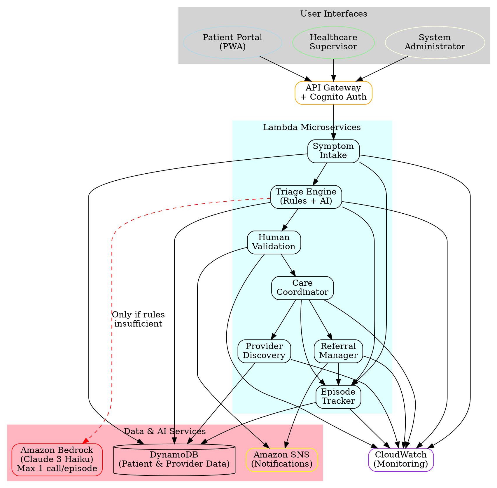

# AI-Enabled Decentralized Care Orchestration System Architecture

## High-Level Architecture Diagram

> **Note**: This diagram was created as a text-based representation due to MCP Graphviz server compatibility issues on Windows. The visual representation below provides comprehensive architectural details.

```
┌─────────────────────────────────────────────────────────────────────────────────┐
│                              USER INTERFACES                                   │
├─────────────────┬─────────────────────┬─────────────────────────────────────────┤
│   Patient       │   Healthcare        │   System Administrator                 │
│   Portal        │   Supervisor        │   Console                              │
│   (PWA)         │   Dashboard         │                                        │
└─────────────────┴─────────────────────┴─────────────────────────────────────────┘
         │                       │                       │
         │                       │                       │
         ▼                       ▼                       ▼
┌─────────────────────────────────────────────────────────────────────────────────┐
│                    API GATEWAY + COGNITO AUTHENTICATION                        │
│              (Rate Limiting, Request Routing, Security)                       │
└─────────────────────────────────────────────────────────────────────────────────┘
         │
         ▼
┌─────────────────────────────────────────────────────────────────────────────────┐
│                           LAMBDA MICROSERVICES                                 │
│  ┌─────────────┐ ┌─────────────┐ ┌─────────────┐ ┌─────────────────────────┐   │
│  │   Symptom   │ │   Triage    │ │   Human     │ │      Provider           │   │
│  │   Intake    │ │   Engine    │ │ Validation  │ │     Discovery           │   │
│  │   Service   │ │ (Rules+AI)  │ │   Service   │ │     Service             │   │
│  └─────────────┘ └─────────────┘ └─────────────┘ └─────────────────────────┘   │
│  ┌─────────────┐ ┌─────────────┐ ┌─────────────┐ ┌─────────────────────────┐   │
│  │    Care     │ │   Referral  │ │   Episode   │ │       Alert             │   │
│  │ Coordinator │ │   Manager   │ │   Tracker   │ │      Service            │   │
│  │   Service   │ │   Service   │ │   Service   │ │                         │   │
│  └─────────────┘ └─────────────┘ └─────────────┘ └─────────────────────────┘   │
└─────────────────────────────────────────────────────────────────────────────────┘
         │                       │                       │
         ▼                       ▼                       ▼
┌─────────────────┐    ┌──────────────────┐    ┌─────────────────────────────────┐
│    DynamoDB     │    │   Amazon SNS     │    │     Amazon Bedrock              │
│                 │    │                  │    │   (Claude 3 Haiku)             │
│ • Patient Data  │    │ • Supervisor     │    │                                 │
│ • Provider Data │    │   Alerts         │    │ • Max 1 call per episode       │
│ • Episodes      │    │ • Emergency      │    │ • Only when rules insufficient │
│ • Referrals     │    │   Notifications  │    │ • Human validation required    │
│                 │    │ • Status Updates │    │                                 │
└─────────────────┘    └──────────────────┘    └─────────────────────────────────┘

┌─────────────────┐    ┌──────────────────┐    ┌─────────────────────────────────┐
│   CloudWatch    │    │ Amazon Transcribe│    │        AWS Free Tier            │
│                 │    │   (Optional)     │    │                                 │
│ • Monitoring    │    │                  │    │ • Lambda: 1M requests/month    │
│ • Logging       │    │ • Voice to Text  │    │ • DynamoDB: 25GB storage       │
│ • Alerting      │    │ • Multilingual   │    │ • API Gateway: 1M calls/month  │
│ • Metrics       │    │   Support        │    │ • CloudWatch: Basic monitoring │
└─────────────────┘    └──────────────────┘    └─────────────────────────────────┘
```

## Data Flow Architecture

```
Patient Symptom Input
         │
         ▼
┌─────────────────┐
│ Symptom Intake  │ ──────────┐
│    Service      │           │
└─────────────────┘           │
         │                    │
         ▼                    ▼
┌─────────────────┐    ┌─────────────┐
│ Rule-Based      │    │  DynamoDB   │
│ Triage Engine   │    │   Storage   │
└─────────────────┘    └─────────────┘
         │
         ▼
    ┌─────────┐
    │ Rules   │ ──── YES ──┐
    │Sufficient?│          │
    └─────────┘           │
         │ NO             │
         ▼                │
┌─────────────────┐       │
│ Amazon Bedrock  │       │
│ (Claude 3 Haiku)│       │
│ Single AI Call  │       │
└─────────────────┘       │
         │                │
         ▼                │
┌─────────────────┐ ◄─────┘
│ Human Validation│
│ (MANDATORY)     │
└─────────────────┘
         │
         ▼
┌─────────────────┐
│ Care Pathway    │
│ Recommendation  │
└─────────────────┘
         │
         ▼
┌─────────────────┐
│ Provider        │
│ Discovery &     │
│ Routing         │
└─────────────────┘
         │
         ▼
┌─────────────────┐
│ Patient Care    │
│ Coordination    │
└─────────────────┘
```

## Human-in-the-Loop Architecture

```
┌─────────────────────────────────────────────────────────────────┐
│                    AI DECISION CHECKPOINTS                     │
└─────────────────────────────────────────────────────────────────┘

AI Assessment Generated
         │
         ▼
┌─────────────────┐
│ Queue for Human │ ──── SNS Alert ──► Healthcare Supervisor
│   Validation    │
└─────────────────┘
         │
         ▼
┌─────────────────┐
│ Supervisor      │ ──── Approve ────┐
│ Review & Decision│                  │
└─────────────────┘                  │
         │                           │
    Override/Reject                  │
         │                           │
         ▼                           ▼
┌─────────────────┐         ┌─────────────────┐
│ Human Judgment  │         │ AI Recommendation│
│ Takes Priority  │         │   Approved      │
└─────────────────┘         └─────────────────┘
         │                           │
         └─────────┬─────────────────┘
                   │
                   ▼
         ┌─────────────────┐
         │ Patient Routing │
         │   Execution     │
         └─────────────────┘

Emergency Escalation Path:
Emergency Detected ──► Immediate Supervisor Alert ──► Human Validation ──► Direct Hospital Routing
```

## Cost Optimization Architecture

```
┌─────────────────────────────────────────────────────────────────┐
│                      COST CONTROL LAYERS                       │
└─────────────────────────────────────────────────────────────────┘

AWS Free Tier Services (Primary):
• Lambda (1M requests/month)
• DynamoDB (25GB storage)
• API Gateway (1M calls/month)
• CloudWatch (Basic monitoring)
• Cognito (50,000 MAUs)

Standard Tier (Justified Usage):
• SNS (Notifications only)
• Step Functions (If orchestration needed)

AI Services (Strict Limits):
• Bedrock: MAX 1 call per care episode
• Transcribe: Optional voice input only

Cost Monitoring:
┌─────────────────┐    ┌─────────────────┐    ┌─────────────────┐
│ Request Counter │    │ AI Usage Tracker│    │ Cost Alerts     │
│ Per Episode     │ ──►│ Per Episode     │ ──►│ Via CloudWatch  │
└─────────────────┘    └─────────────────┘    └─────────────────┘
```

## Security & Compliance Architecture

```
┌─────────────────────────────────────────────────────────────────┐
│                    SECURITY LAYERS                             │
└─────────────────────────────────────────────────────────────────┘

Data Protection:
┌─────────────────┐    ┌─────────────────┐    ┌─────────────────┐
│ TLS Encryption  │    │ KMS Encryption  │    │ IAM Role-Based  │
│ In Transit      │ ──►│ At Rest         │ ──►│ Access Control  │
└─────────────────┘    └─────────────────┘    └─────────────────┘

Authentication Flow:
Patient/Provider ──► Cognito ──► JWT Token ──► API Gateway ──► Lambda Functions

Audit Trail:
All Actions ──► CloudWatch Logs ──► Audit Dashboard ──► Compliance Reports

Privacy Compliance:
• Data minimization
• Consent management
• Right to deletion
• ABDM alignment (conceptual)
```

## Scalability Architecture

```
┌─────────────────────────────────────────────────────────────────┐
│                   AUTO-SCALING DESIGN                          │
└─────────────────────────────────────────────────────────────────┘

Traffic Patterns:
Low Traffic ──► Lambda Cold Start ──► Gradual Warm-up ──► Auto-scaling

High Traffic ──► Lambda Concurrent Execution ──► DynamoDB Auto-scaling

Peak Load Handling:
┌─────────────────┐    ┌─────────────────┐    ┌─────────────────┐
│ API Gateway     │    │ Lambda          │    │ DynamoDB        │
│ Rate Limiting   │ ──►│ Concurrency     │ ──►│ On-Demand       │
│ (Throttling)    │    │ Limits          │    │ Scaling         │
└─────────────────┘    └─────────────────┘    └─────────────────┘

Failure Handling:
Service Failure ──► Circuit Breaker ──► Graceful Degradation ──► User Notification
```

## Key Architectural Principles

1. **Human-First Safety**: All AI decisions require human validation
2. **Cost-Conscious Design**: Maximize free tier usage, minimize AI calls
3. **India-Specific Optimization**: Low bandwidth, multilingual, cost-sensitive
4. **Serverless Scalability**: Auto-scaling without infrastructure management
5. **Security by Design**: Encryption, authentication, audit trails
6. **Responsible AI**: Limited, explainable, human-supervised AI usage
7. **Fault Tolerance**: Graceful degradation and error recovery
8. **Compliance Ready**: ABDM alignment and privacy protection

## Technology Stack Summary

| Component | AWS Service | Tier | Justification |
|-----------|-------------|------|---------------|
| Frontend | S3 + CloudFront | Free | Static PWA hosting |
| API Layer | API Gateway | Free | Request routing & auth |
| Compute | Lambda | Free | Serverless functions |
| Database | DynamoDB | Free | NoSQL patient/provider data |
| Authentication | Cognito | Free | User management |
| AI/ML | Bedrock | Paid | Limited AI assistance |
| Notifications | SNS | Standard | Critical alerts only |
| Monitoring | CloudWatch | Free | Basic monitoring |
| Voice (Optional) | Transcribe | Standard | Voice input processing |

**Estimated Monthly Cost for MVP**: $50-100 USD (primarily Bedrock usage)
**Target Patient Volume**: 10,000 episodes/month within free tier limits

## Alternative: DOT Language Specification

Since the MCP Graphviz server has Windows compatibility issues, here's the DOT language specification that can be used with any Graphviz installation:



## How to Generate the Visual Diagram

To create a visual PNG/SVG from this DOT specification:

1. **Install Graphviz locally**:
   - Windows: Download from https://graphviz.org/download/
   - Or use: `choco install graphviz` (if you have Chocolatey)

2. **Save the DOT code** to a file named `healthcare_architecture.dot`

3. **Generate the diagram**:
   ```bash
   # Generate PNG
   dot -Tpng healthcare_architecture.dot -o healthcare_architecture.png
   
   # Generate SVG (scalable)
   dot -Tsvg healthcare_architecture.dot -o healthcare_architecture.svg
   
   # Generate PDF
   dot -Tpdf healthcare_architecture.dot -o healthcare_architecture.pdf
   ```

## Interactive Diagram Creation

You can also use online Graphviz tools:
- **Graphviz Online**: https://dreampuf.github.io/GraphvizOnline/
- **Viz.js**: http://viz-js.com/
- **Edotor**: https://edotor.net/

Simply paste the DOT code above into any of these tools to generate the visual diagram.

---